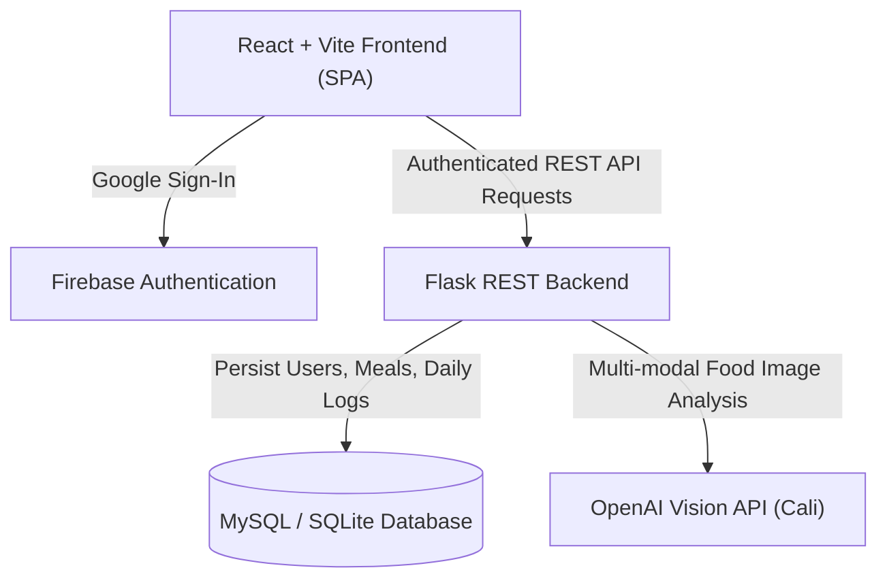

# Calorify Architecture

Calorify is an AI-powered calorie and nutrition tracking platform featuring image-based food analysis, daily macronutrient breakdown, and hydration tracking.

## System Topology

## Core Modules
- **Frontend**: React 18 SPA built with Vite, Axios, Lucide Icons, and Vanilla CSS glassmorphic design.
- **Backend**: Python Flask REST API with SQLAlchemy ORM, Blueprint routing, and OpenAI SDK integration.
- **Database**: Relational schema supporting users, timestamped food entries, and daily aggregation logs.
- **Authentication**: Google Firebase OAuth provider for secure token-based user identity.
